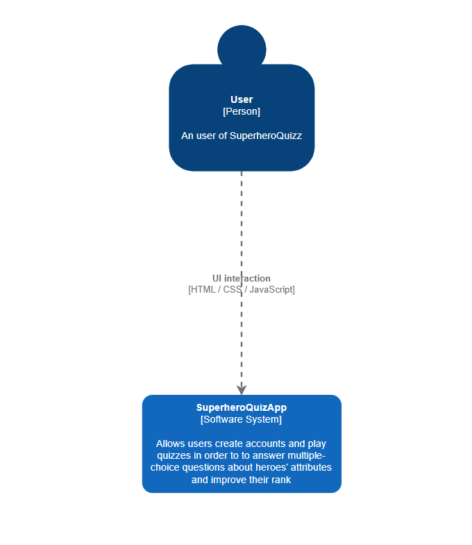
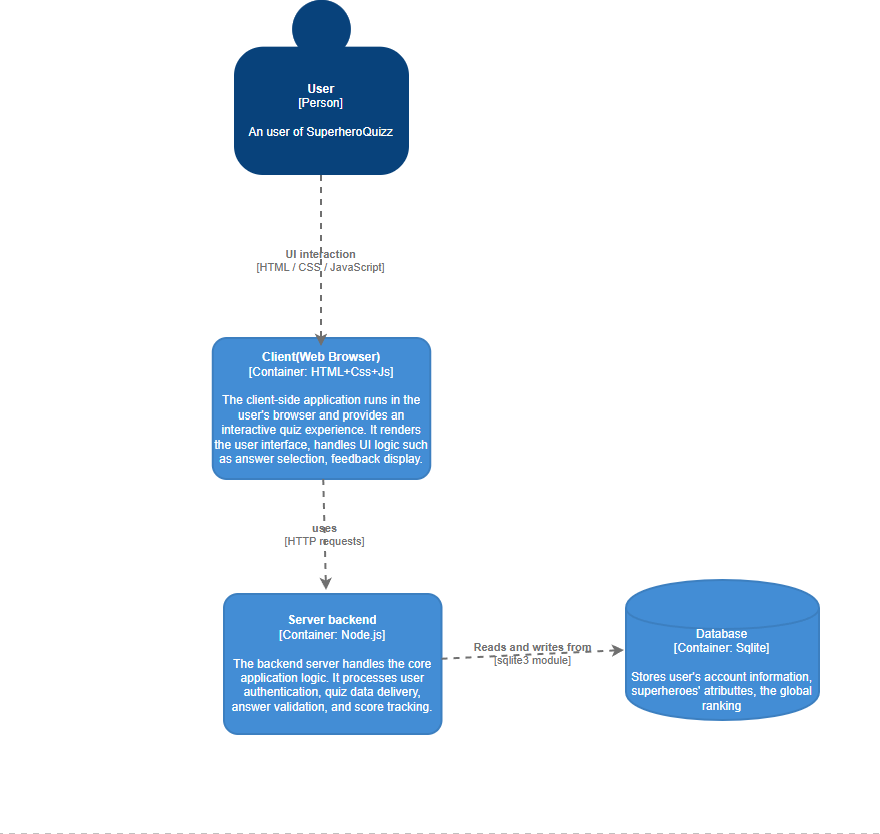
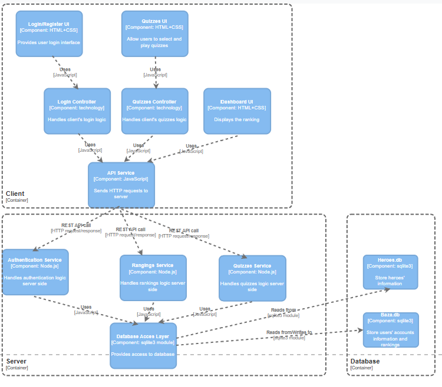

# Proiect-Web

##  Description

**Superhero Quiz** is an educational, interactive web application designed for children, combining fun gameplay with learning elements based on popular Marvel and DC superheroes. The goal of the app is to engage young users in a playful way while helping them improve their general knowledge about superhero characters.

The application offers a variety of themed multiple-choice quizzes focused on topics such as the hero’s universe (Marvel/DC), eye and hair color, first appearance year, special traits, and more. Users receive immediate feedback for each answer. Incorrect answers cost one of their three available lives per quiz, encouraging careful thinking and learning from mistakes.

To play, users must first authenticate by logging into their account. Their performance is tracked and scored, with a global leaderboard allowing users to climb in ranking by achieving higher scores. The user interface is kid-friendly and mobile-responsive.

The app also features internationalization, supporting English and Romanian, with the interface text loaded dynamically from JSON translation files.

Technically, the project follows a clear separation of concerns. The frontend is built using HTML, CSS, and JavaScript, running directly in the browser and handling UI interactions. The backend is powered by Node.js, exposing RESTful APIs that handle user authentication, quiz data, answer validation, and score tracking. All persistent data, including user accounts and quiz questions, is stored in a lightweight SQLite database accessed via the sqlite3 module.

##  Features

-  Multiple quiz categories with superhero trivia
-  User authentication (login/register)
-  Life system (3 lives per quiz)
-  Global leaderboard with real-time score tracking
-  Internationalization (English, Romanian)
-  Accessible & responsive design (ARIA + mobile)
-  Instant feedback for each answer
-  Easy-to-update questions (CSV/JSON import)

---

## 🛠️ Technologies Used

### Frontend
- HTML5
- CSS3 (with responsive design techniques)
- JavaScript 

### Backend
- Node.js (Express)
- SQLite (via `sqlite3` package)
- REST API (for quiz management, auth, score tracking)

- ##  Installation

1. **Clone the repository**
   ```bash
   git clone https://github.com/your-username/superhero-quiz.git
   cd superhero-quiz
2. **Install dependencies**
      ```bash
   npm install
3. **Start the server**
     ```bash
   node server.js
4.**Open your browser** 
at http://localhost:3000

##  Diagrams








